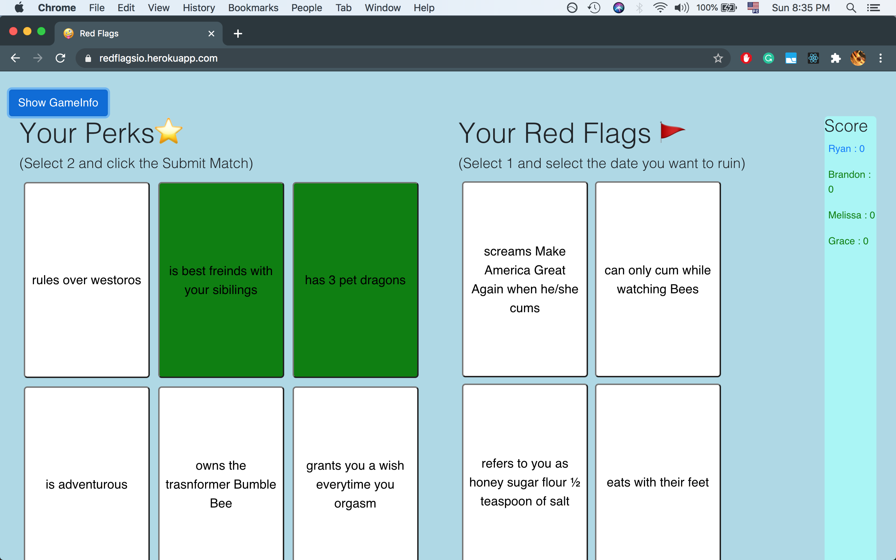
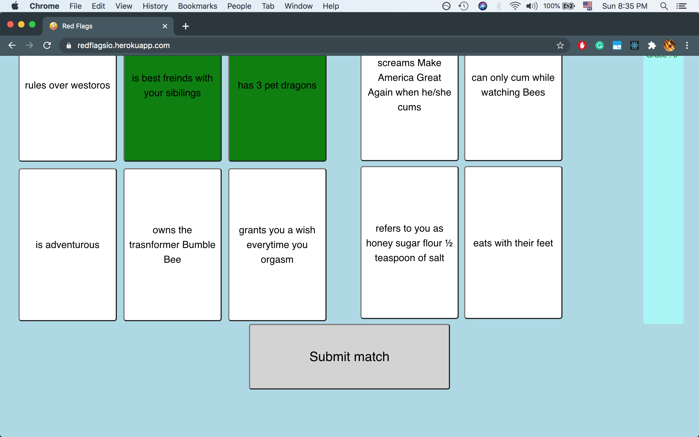
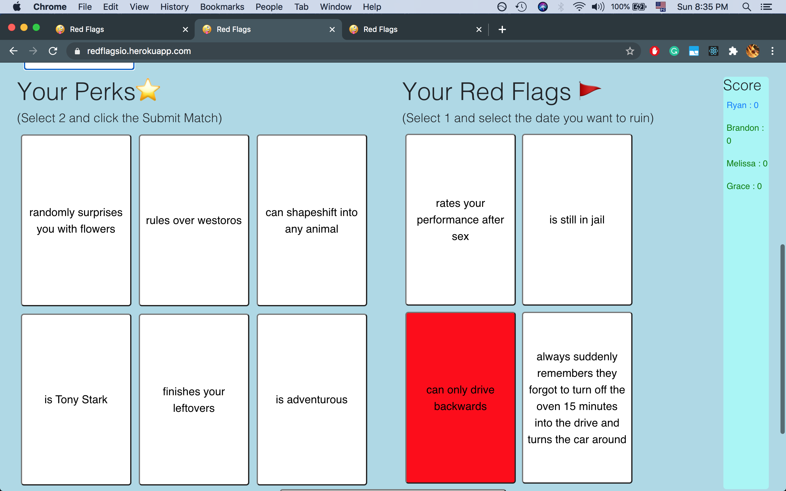
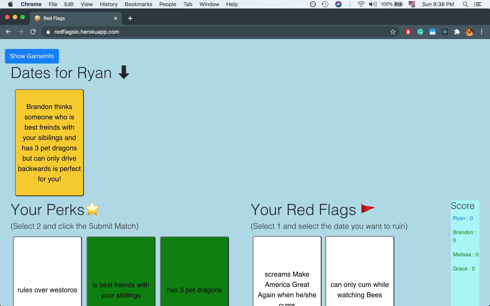
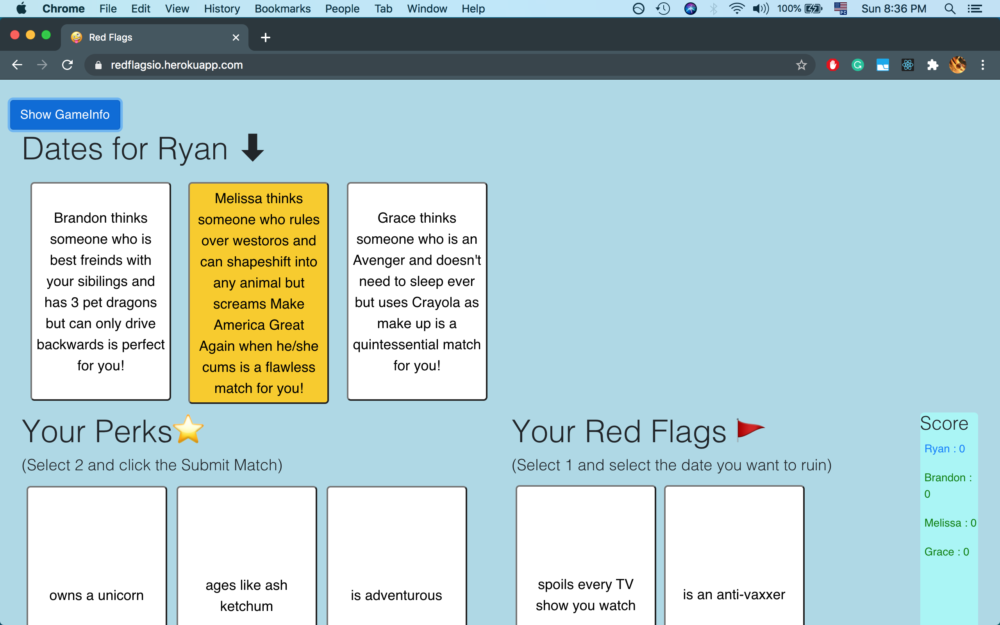

# [Redflagsio](https://redflagsio.herokuapp.com/)

Redflagsio is a modified web app version of the popular board game [Red flags](https://store.skybound.com/products/red-flags-main-card-game?variant=11215546054). This project was built on a Node.js server that serves a React front end for clients. Communication between server and client is facilitated using [Socket.io](https://socket.io/).

<div align="center">
    
    
    
    
    
    
</div>

### Getting Started

These instructions will get you a copy of the proejct up and running on your local machine for development and testing purposes.

### Prerequisites

Clone proj

```
git clone https://github.com/tyranitar898/redflagsio.git
```

cd into project directory and install dependencies

```
cd redflagsio
npm install
```

Run locally (runs test script)

```
npm run test
```

Now you can visit it at http://localhost:3000/

## Built With

- [Socketio](https://socket.io/) - Websocket library, to communicate between the client and the server.
- [Express](https://expressjs.com/) - Web framework for Node.js, to power its web server.
- [React](https://reactjs.org/) - for frontend.

## Authors

- **Ryan Chang** - _Developer_ - [Personal Website](http://ryanchang.online/)
